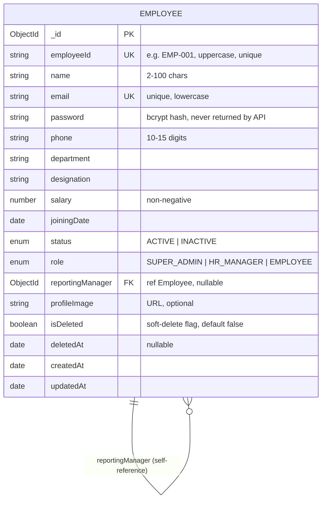

# Database Schema

Database: **MongoDB** (Mongoose ODM). The system uses a single `employees`
collection — every user of the system *is* an employee, so authentication
fields live on the same document as the profile. The reporting hierarchy is a
**self-reference**: each employee optionally points at another employee as
their manager.

## ER Diagram

Department and Role are stored as embedded values rather than separate
collections — see [DESIGN_DECISIONS.md](DESIGN_DECISIONS.md) for why.

## Field Reference

| Field | Type | Constraints |
|---|---|---|
| `employeeId` | String | required, **unique**, uppercased, `[A-Z0-9-]` |
| `name` | String | required, 2–100 chars |
| `email` | String | required, **unique**, lowercased, format-validated |
| `password` | String | required, min 6 chars, bcrypt-hashed in a pre-save hook, `select: false` |
| `phone` | String | required, `+`-optional 10–15 digits |
| `department` | String | required |
| `designation` | String | required |
| `salary` | Number | required, ≥ 0 |
| `joiningDate` | Date | required |
| `status` | Enum | `ACTIVE` (default) / `INACTIVE` |
| `role` | Enum | `SUPER_ADMIN` / `HR_MANAGER` / `EMPLOYEE` (default) |
| `reportingManager` | ObjectId → Employee | nullable; cycle-checked before every write |
| `profileImage` | String | optional URL |
| `isDeleted` / `deletedAt` | Boolean / Date | soft delete; deleted docs are excluded from every query |
| `createdAt` / `updatedAt` | Date | automatic (Mongoose timestamps) |

## Indexes

| Index | Purpose |
|---|---|
| `email` (unique) | login lookup + duplicate prevention |
| `employeeId` (unique) | business-key duplicate prevention |

## Invariants enforced in code

1. **No circular reporting** — before saving a `reportingManager`, the API
   walks up the proposed manager's chain; if it reaches the employee being
   edited, the write is rejected (400).
2. **Soft delete cascades sensibly** — deleting a manager reassigns their
   direct reports to the deleted manager's own manager (or null).
3. **Password is never serialized** — stripped both by `select: false` and in
   the model's `toJSON`.
